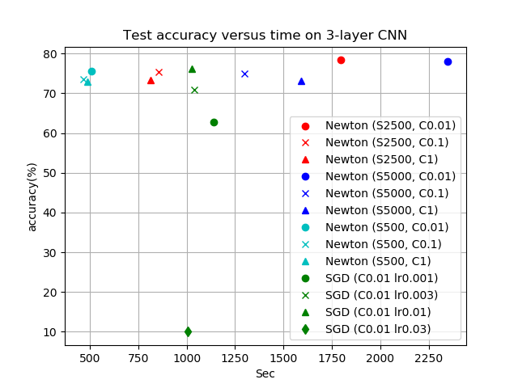
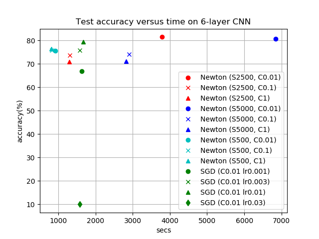
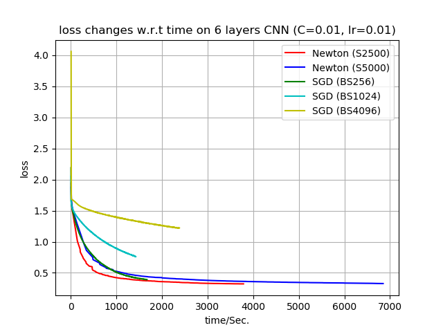

# SimpleNN_Tensorflow

A Tensorflow implementation of SimpleNN with GPU support. 

# Requirements
Python dependecies:
```
python 3.5.2
tensorflow 1.13.1
```

# Train
**We do not feed the whole subsampled data into GPU memory to evaluate sub-sampled Gauss-Newton matrix vector product.** Instead we divide the samples into segments of size **bsize** and accumulate results to avoid the out-of-memory issue.

 For the data format, currently we assume the same format as the **MATLAB** code. See details in the README file of the **MATLAB** directory. The **read_data** function in the **utilities.py** will read **MATLAB** file, perform data normalization and reshape the input data. Please make sure the input data is in **MATLAB** format, and each input instance is vectorized.

input:

- **data**: (NUM_OF_DATA, DIMENSION_OF_DATA)
- **labels**: (NUM_OF_DATA,)

return:
- **data**: (NUM_OF_DATA, HEIGHT, WIDTH, CHANNEL)
- **labels**: (NUM_OF_DATA,)


<!-- For your own dataset, you may want to rewrite the **read_data** function in the **utilities.py** file which returns tuple **(data, labels)** in numpy format. 

- **data**: (NUM_OF_DATA × DIMENSION_OF_DATA)
- **labels**: (NUM_OF_DATA × NUMBER_OF_CLASS)

If you want to rewrite our model, the model needs to return a tuple **(x, y, outputs)**. (Note: batchnorm layer has not been fully understood and supported yet)

- **x**: placeholder for input 
- **y**: placeholder for label
- **outputs**: output value of the neural network (pre-softmax layer) -->

## Examples
To use Newton optimizer, please run:
```
CUDA_VISIBLE_DEVICES=0 python3 train.py --optim NewtonCG --s 100 --C 0.01  \
						--net CNN_3layers --bsize 1024 \
						--train_set ./data/mnist-demo.mat \
						--val_set ./data/mnist-demo.t.mat --dim 28 28 1
```
To use SGD optimizer, please run:
```
CUDA_VISIBLE_DEVICES=0 python3 train.py --optim SGD --lr 0.01 --C 0.01 \
						--net CNN_3layers --bsize 256 \
						--train_set ./data/mnist-demo.mat \
						--val_set ./data/mnist-demo.t.mat --dim 28 28 1
```

## Arguments
In this section, we show option/parameters that are solely for Tensorflow implementation. The remaining arguments are maintained the same as the MATLAB version of [SimpleNN](https://github.com/cjlin1/simpleNN/tree/master/MATLAB). The sample usage given below also indicates the default value of each parameter.

### General
1. **--optim**: the optimization method used for training CNN. (NewtonCG, SGD or Adam)
```
--optim NewtonCG
```
2. **--net**: network configuration (two examples are CNN_3layers and CNN_6layers)
```
--net CNN_3layers
```
3. **--train_set** & **--val_set**: provide the address of .mat file for training or validation.
```
--train_set data/mnist-demo.mat
```
4. **--model**: save log and model to directory log_and_model
```
--model ./log_and_model/logger.log
```
5. **--loss**: which loss function to use: MSELoss or CrossEntropy
```
--loss: MSELoss
```
6. **--bsize**: Split data into segements of size **bsize** so that each segment can fit into memroy, for evaluating Gv, stochastic gradient and global graident. If you encounter Out of Memory (OOM) during training, you may decrease the **--bsize** paramter to an appropriate value.
```
--bsize 1024;
```
7. **--screen_log_only**: log printed on screen only; not stored to the model
```
--screen_log_only
```
8. **--C**: regularization parameter. Regularization term = 1/(2C × num_data) × L2_norm(weight)
```
--C math.inf
```
9. **--dim**: input dimension of data. Shape must be: height width num_channels
```
--dim 28 28 1
```
10. **--num_cls**: number of classes in the dataset
```
--num_cls 10
```

### Newton Method

1. **--s**: number of samples used in the subsampled Gauss-Newton matrix.
```
--s 5000
```

### SGD
1. **--decay**: divide learning rate by 10 every **decay** epochs
```
--decay 500
```
2. **--momentum**: SGD + momentum
```
--momentum 0
```

# Predict

## Example
```
CUDA_VISIBLE_DEVICES=0 python3 predict.py --net CNN_3layers --bsize 1024 \
						--test_set ./data/mnist-demo.t.mat \
						--model ./log_and_model/best-model.ckpt
```

## Arguments
You may need the following arguments to run the predict script:
1. **--model**: address of the saved model from training, e.g. ./log_and_model/best-model.ckpt
```
--model ./log_and_model/best-model.ckpt
```
2. **--net**: network configuration used in training (two examples are CNN_3layers and CNN_6layers)
```
--net CNN_3layers
```
3. **--test_set**: provide the directory of .mat file for test.
```
--test_set data/mnist-demo.t.mat
```
4. **--dim**: input dimension of data. Shape must be: height width num_channels
```
--dim 28 28 1
```
5. **--num_cls**: number of classes in the dataset
```
--num_cls 10
```

# Experiment Results
In the following experiments, we run 100 Newton steps on Newton method and 500 epochs on SGD. We report our resutls on both 3-layer and 6-layer CNN with MSE loss function. We consider the same 3-layer CNN setting in [Wang et al.](https://www.csie.ntu.edu.tw/~cjlin/papers/cnn/newton-CNN.pdf). Other settings such as the initialization are also the same as [Wang et al.](https://www.csie.ntu.edu.tw/~cjlin/papers/cnn/newton-CNN.pdf) for both 3-layer and 6-layer CNN. Both netowrks are trained and tested on CIFAR10 dataset. To reproduce our results, you may download training set [cifar10.mat](https://www.csie.ntu.edu.tw/~cjlin/libsvmtools/datasets/multiclass/cifar10.mat) and test set[cifar10.t.mat](https://www.csie.ntu.edu.tw/~cjlin/libsvmtools/datasets/multiclass/cifar10.t.mat) to ./data directory.

## Experiments on 3 layer CNN

### Wall clock time comparison



### Test accuracy changes w.r.t. regularization constant.
C | 10% sub-sampled Gv| 5% sub-sampled Gv| 1% sub-sampled Gv
--|-----|----|---
0.01l|78.09%|78.33%|75.62%
0.1l|74.96%|75.33%|73.45%
1l|73.03%|73.35%|72.82%

Memory | bsize 1024 | bsize 512| bsize 256
--|-----|----|---
10% sub-sampled Gv|3.1 GB |1.8 GB|1.1 GB
5% sub-sampled Gv |3.1 GB |1.8 GB|1.1 GB
1% sub-sampled Gv |3.1 GB |1.8 GB|1.1 GB
SGD |3.1 GB|1.8 GB|1.1 GB|

## Experiments on 6 layer CNN
### Wall clock time comparison





### Test accuracy changes w.r.t. regularization constant.
C | 10% sub-sampled Gv| 5% sub-sampled Gv| 1% sub-sampled Gv
--|-----|----|---
0.01l|80.61%|81.41%|75.50%
0.1l|74.06%|73.55%|75.90%
1l|71.03%|70.83%|76.29%

Memory | bsize 1024 | bsize 512| bsize 256
--|-----|----|---
10% sub-sampled Gv|7.2 GB |3.8 GB|2.1 GB
5% sub-sampled Gv |7.2 GB |3.8 GB|2.1 GB
1% sub-sampled Gv |7.2 GB |3.8 GB|2.1 GB
SGD |7.2 GB|3.8 GB|2.1 GB|